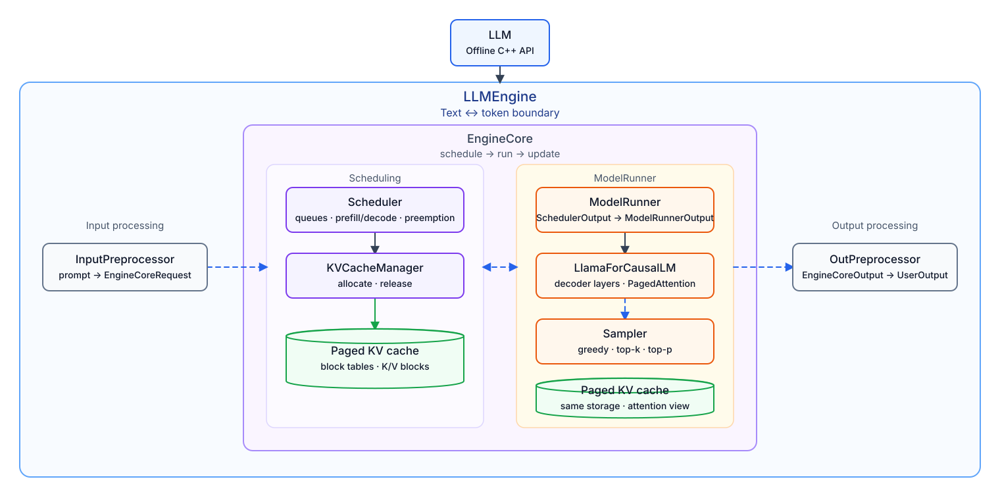

# Tiny-LLM-Inference

[](https://github.com/wlmrh/Tiny-LLM-Inference/actions/workflows/ci.yml)
[](https://github.com/wlmrh/Tiny-LLM-Inference/releases)
[](LICENSE)

Tiny-LLM-Inference is a compact C++17/CUDA decoder-only LLM inference engine inspired by vLLM. It implements the core path from Hugging Face checkpoint loading through request scheduling, paged KV cache management, model execution, sampling, and reproducible correctness/performance evaluation.

The project is intentionally scoped as a **single-process, single-device, offline runtime** for systems learning and controlled experiments. It is not an HTTP/gRPC service, distributed serving stack, or production-SLA claim.

## Architecture



```text
LLM -> LLMEngine -> EngineCore -> Scheduler / ModelRunner -> Model
```

- `LLM` owns user-facing offline generation resources.
- `LLMEngine` handles text/tokenizer I/O.
- `EngineCore` coordinates scheduling and model execution over token IDs.
- `Scheduler` owns request state, chunked prefill/decode decisions, preemption, and paged KV lifecycle.
- `ModelRunner` prepares tensors and runtime metadata, invokes the model, and samples request-final rows.
- LLaMA/SmolLM2 and Qwen2-family checkpoints share the LLaMA-style model path.

See [Architecture](docs/Architecture.md) for ownership, scheduling, KV cache, tensor metadata, and device boundaries.

## Highlights

- Hugging Face `tokenizer.json`/SentencePiece and single-file or sharded safetensors loading.
- LLaMA/SmolLM2-compatible and Qwen2-family checkpoints, including Qwen2.5-1.5B-Instruct.
- FCFS-style waiting/running queues with chunked prefill/decode and tail preemption.
- Scheduler-owned paged KV cache with explicit runtime attention metadata.
- CPU execution and an optional single-device CUDA path with experimental BF16 compute/KV modes.
- Transformers/vLLM comparison, request-event tracing, and offline/open-loop benchmark suites.

## Verified v0.1.0 Results

Release validation used candidate commit `25e2355921b033abb89091d15f768c57c715c63c` with `git_dirty=false`, an NVIDIA GeForce RTX 4080 SUPER, driver 595.71.05, CUDA 12.8, pinned Qwen2.5-1.5B-Instruct revision `989aa798...`, and FP32 compute/KV for headline measurements.

| Validation | Result |
| --- | --- |
| TinyLLM / Transformers / vLLM greedy token agreement | Exact pairwise match; 0 mismatches, no backend skips |
| CPU and CUDA test suites | CPU 65/65 plus 7/7 model-backed; CUDA 78/78 |
| Five 200-request open-loop workloads | 200/200 each; complete events and monotonic percentiles |

| Workload | Backend | TTFT ms | E2E tok/s | Decode tok/s |
| --- | --- | ---: | ---: | ---: |
| interactive | TinyLLM | 18.716 | 87.985 | 88.897 |
| interactive | Transformers | 26.268 | 45.505 | 45.646 |
| interactive | vLLM | 32.426 | 103.138 | 107.124 |
| long-prefill | TinyLLM | 520.538 | 131.462 | 176.620 |
| long-prefill | Transformers | 514.774 | 118.813 | 153.670 |
| long-prefill | vLLM | 62.298 | 357.240 | 385.141 |
| decode-heavy | TinyLLM | 109.237 | 503.314 | 527.716 |
| decode-heavy | Transformers | 117.006 | 285.493 | 292.814 |
| decode-heavy | vLLM | 55.157 | 731.557 | 755.617 |

| Open-loop workload | TTFT p99 ms | E2E p99 ms |
| --- | ---: | ---: |
| Poisson 0.50C (1.966050 req/s) | 65.606 | 956.106 |
| Poisson 0.90C (3.538890 req/s) | 66.929 | 1068.512 |

TinyLLM outperformed the tested Transformers baseline across the three performance workloads, but trailed vLLM in end-to-end and decode throughput. Long-prefill is the clearest limitation: TinyLLM TTFT was 520.538 ms versus vLLM's 62.298 ms. See the [complete v0.1.0 benchmark report](benchmark/reports/v0.1.0/README.md) for workload definitions, all open-loop percentiles, raw JSON, pinned model hashes, and reproduction commands.

Performance results apply only to their recorded environment and workload. A baseline comparison is not a claim of production parity with vLLM, SGLang, or TensorRT-LLM.

## Three-Step Reproduction

```bash
# 1. Configure and build the CPU release preset.
cmake --preset cpu-release
cmake --build --preset cpu-release -j

# 2. Run deterministic local generation.
./build/cpu-release/offline_llm /models/smollm2-135M cpu

# 3. Check benchmark command plumbing without running a long benchmark.
python3 benchmark/industrial_benchmark.py --preset quick --dry-run
```

## Status and Scope

- Local Hugging Face checkpoint directories only; no model download layer is included in the runtime.
- CPU is the default backend; CUDA supports one selected device when enabled at build time.
- No concurrent multi-engine guarantee, serving protocol, tensor/pipeline parallelism, prefix caching, LoRA, quantization, or multimodal path.
- BF16 is an experimental CUDA path with FP32 master weights/operator boundaries; benchmark it on the target workload rather than assuming a speedup.

See [Project Status](docs/Project_Status.md) for the support matrix, explicit non-goals, and benchmark-claim policy.

## C++ API Example

```cpp
#include "tiny_llm/runtime/llm.h"

#include <iostream>
#include <vector>

int main()
{
    tiny_llm::LLM llm("/models/smollm2-135M");

    tiny_llm::LLMSamplingParams params;
    params.temperature = 0.8f;
    params.top_p = 0.95f;

    const std::vector<std::string> prompts = {
        "Hello, my name is",
        "The capital of France is",
    };

    const auto outputs = llm.generate(prompts, params);
    for (const auto &output : outputs)
    {
        std::cout << output.text << "\n";
    }
}
```

The same flow is available through the built example:

```bash
./build/cpu-release/offline_llm /models/smollm2-135M cpu
./build/cuda-release/offline_llm /models/Qwen2.5-1.5B-Instruct cuda:0
```

## Requirements

- CMake 3.20+
- C++17 compiler
- Python with PyTorch/libtorch available to CMake
- Rust `cargo` for `tokenizers-cpp`
- CUDA Toolkit when building with `TINYLLM_ENABLE_CUDA=ON`

## Build

Preset-based builds are the recommended reproducible path:

```bash
cmake --preset cpu-release
cmake --build --preset cpu-release -j
```

CUDA build:

```bash
cmake --preset cuda-release \
  -DCMAKE_CUDA_COMPILER=/usr/local/cuda-12.8/bin/nvcc \
  -DCUDAToolkit_ROOT=/usr/local/cuda-12.8
cmake --build --preset cuda-release -j
```

The explicit configure path remains available for custom build directories:

```bash
cmake -S . -B build-custom -DTINYLLM_ENABLE_CUDA=OFF
cmake --build build-custom -j
```

Main outputs are the `tiny_llm` static library, the `offline_llm` API example, generation/debug tools under the selected build directory, and tests under its `tests/` subdirectory.

## Run Generation

Use a local Hugging Face checkpoint directory containing `config.json`, `tokenizer.json` or `tokenizer.model`, and safetensors weights.

```bash
./build/cpu-release/tools/llama_engine_generate \
  /models/smollm2-135M \
  8 \
  hello
```

```bash
./build/cuda-release/tools/llama_engine_generate \
  --device cuda:0 \
  --dtype bf16 \
  --kv-cache-dtype bf16 \
  /models/Qwen2.5-1.5B-Instruct \
  8 \
  hello
```

`llama_engine_generate` prints one JSON object per prompt and also supports `--kv-num-blocks N`.

## Benchmarks

The config-driven suite writes workload JSONL, TinyLLM request event traces, summary JSON, and Markdown reports:

```bash
python3 benchmark/run_benchmark_suite.py \
  --config benchmark/configs/qwen25_quick.json \
  --backend tinyllm,transformers
```

For focused optimization loops and release regression checks:

```bash
python3 benchmark/industrial_benchmark.py --preset focus
python3 benchmark/industrial_benchmark.py --preset regression
```

See [Tools, Tests, and Benchmarks](docs/modules/Tools_Tests_and_Benchmarks.md) for workload and reporting details.

## Tests

```bash
cmake --preset ci-cpu
cmake --build --preset ci-cpu --parallel 2
ctest --preset ci-cpu
```

Model-backed tests use `TINYLLM_HF_TINY_LLAMA_DIR`; they skip rather than downloading a model. Public CI runs model-independent CPU tests. CUDA and real-model checks are release gates on a GPU host.

## Documentation

Start with [docs/README.md](docs/README.md). Contributions follow [CONTRIBUTING.md](CONTRIBUTING.md), releases are recorded in [CHANGELOG.md](CHANGELOG.md), and the source is available under the [Apache License 2.0](LICENSE).
