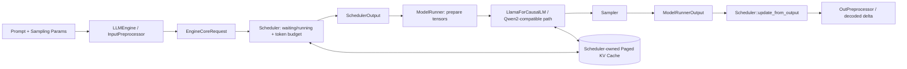

# Tiny-LLM-Inference 面试说明与答辩指南

> 适用方向：AI Infra、LLM Serving、ML Systems、C++/CUDA、推理引擎研发。
> 使用原则：只把自己亲自完成、能解释源码、能说明验证方法的部分称为“我的贡献”。不确定的部分使用“项目目前实现了”而不是“我实现了”。

## 1. 面试官应该记住什么

一句话定位：

> Tiny-LLM-Inference 是一个受 vLLM 启发、使用 C++17、libtorch 和 CUDA 实现的单进程单 GPU 解码器大模型推理引擎。我围绕 Hugging Face 权重加载、请求调度、Paged KV Cache、模型执行、采样，以及正确性和性能评测，打通了从 checkpoint 到 token 输出的完整链路。

这个项目最有价值的地方不是“支持了一个模型”，也不是“某个局部指标超过了某个框架”，而是形成了一个可解释、可验证的系统闭环：

```text
真实 Hugging Face checkpoint
        -> token 级正确性对齐
        -> Scheduler / Paged KV Cache / Attention
        -> CUDA 与运行时优化
        -> 离线与开放负载 benchmark
        -> 定位瓶颈并约束结论
```

项目的准确边界是：**单进程、单设备、离线推理与系统实验 runtime**。它不是 HTTP/gRPC 服务，不支持多机多卡，也不声称具备生产 SLA。

## 2. 30 秒版本

> 我做了一个小型但完整的 LLM 推理引擎 Tiny-LLM-Inference，目标不是复刻 vLLM 的全部功能，而是亲自理解一条请求从文本输入到 GPU 执行、KV Cache 管理和 token 输出的完整路径。项目使用 C++17、libtorch 和 CUDA，能够加载 Hugging Face 的 tokenizer 与 safetensors，支持 LLaMA/SmolLM2 和 Qwen2 系列模型。运行时由 Scheduler 做 chunked prefill、decode、token budget 和抢占，KV Cache 使用分页管理，ModelRunner 把调度结果转换为模型需要的张量和 attention metadata。除了功能实现，我还做了 Transformers、vLLM 的 token 级正确性对齐，以及离线和 arrival-driven open-loop benchmark。结果说明它在部分 decode 场景优于测试的 Transformers baseline，但整体仍落后 vLLM，尤其是 long-prefill；这个差距也明确了下一步应优化的方向。

## 3. 2 分钟版本

> 我做这个项目的出发点，是想真正理解大模型推理系统中模型计算之外的部分：请求如何被调度、prefill 和 decode 如何共享批次、KV Cache 如何分配和回收，以及怎样证明一个优化既正确又有效。
>
> 整体架构分成四层。最外层 `LLM` 管理 tokenizer、内存和用户 API；`LLMEngine` 负责文本与 token 的转换；`EngineCore` 驱动每个执行 step；内部的 `Scheduler` 管理 waiting/running 队列、token budget、chunked prefill、decode 和 KV 生命周期，`ModelRunner` 则把 scheduler 输出变成 `input_ids`、`positions`、`slot_mapping`、`context_lens` 和 `block_tables`，构造 `RuntimeContext` 后执行 LLaMA/Qwen2 模型并采样。
>
> 我认为项目里最关键的设计是让 Scheduler 成为请求状态和 KV Cache 生命周期的唯一所有者。ModelRunner 只消费显式的 attention metadata，不再维护第二份 KV 状态，这样调度决策、物理 block 分配和 attention 访问保持一致。显存不足时，当前策略会从 running 队列尾部选择请求，释放其 KV block，再把它放回 waiting 队列重算上下文。这种策略实现简单、能保证前进，但重算成本较高，也是后续可优化点。
>
> 为了避免“代码能运行就算正确”，我做了三层验证：单元和集成测试；与 Transformers、vLLM 的 greedy token IDs 精确对齐；以及绑定 commit、模型、GPU、dtype 和 workload 的 benchmark。v0.1.0 的三后端 greedy 输出没有 token mismatch；当前 realistic-v1 又加入了 BurstGPT 到达/长度窗口、OASST1 内容代理、按窗口校准负载以及 request-level TTFT/TPOT/E2E 事件。实验显示 TinyLLM 在 short-chat、medium-chat 和 long-decode 的测试中优于 Transformers，但仍明显落后 vLLM；long-prefill 是最清晰的瓶颈。对我来说，这个项目最能证明的是我具备从模型格式、运行时状态、内存管理到性能实验和结论审计的端到端能力。

## 4. 5 分钟展开顺序

如果面试官说“详细讲讲”，按以下顺序展开，不要从目录结构开始逐文件介绍。

### 4.1 问题与目标

- 大模型推理不只是一次 `model.forward()`；它还包括请求状态、prefill/decode 组织、KV 生命周期、batch 构造、采样和指标采集。
- 项目目标是实现最小但完整的推理系统，用真实 Hugging Face checkpoint 验证，而不是只做一个玩具矩阵乘法 demo。
- 非目标包括在线协议、多机多卡、生产容错和完整的生产级优化。

### 4.2 一次请求怎样执行



对应的核心调用链：

```text
LLM::generate
  -> LLMEngine::add_request
  -> while has_unfinished_requests
       -> LLMEngine::step
            -> EngineCore::step
                 -> Scheduler::schedule
                 -> ModelRunner::run
                      -> prepare inputs
                      -> Model::forward
                      -> sample rows
                 -> Scheduler::update_from_output
            -> decode incremental output
```

面试表达重点：`EngineCore` 是每一步的编排者；`Scheduler` 和 `ModelRunner` 不直接隐式共享请求状态，而是通过 `SchedulerOutput`、`ModelRunnerOutput` 和显式 runtime metadata 协作。

### 4.3 Scheduler 怎样工作

当前策略可以概括成 **FCFS + running 优先 + 每步 token budget + chunked prefill + tail preemption**。

- `waiting` 保存新请求和被抢占后等待重算的请求。
- `running` 保存已经拥有活跃 KV 状态的请求。
- 每个 step 先考虑 running 请求，再在没有发生 running 抢占时接纳 waiting 请求。
- prefill 可以按 `max_prefill_tokens_per_step` 切块，避免一个长 prompt 独占整个 step。
- decode 请求通常每个 step 处理一个新位置。
- 分配 KV slot 失败时，从 running 尾部选择 victim，释放它的 KV block，将 `num_computed_tokens` 清零，并放回 waiting 队列。

可以主动说明取舍：当前抢占通过“释放并重算”换取实现简单和状态一致性，但长上下文的重算成本高；更成熟的系统可以考虑 swap、优先级、预测剩余长度或 KV-aware admission。

### 4.4 Paged KV Cache 解决什么问题

连续 KV 内存要求预先为每条序列保留较大的连续空间，容易产生内部碎片，也不利于请求动态加入和结束。分页 KV Cache 把逻辑 token 位置映射到固定大小的物理 block：

```text
logical token position
  -> logical block index
  -> block_tables[layer][sequence][logical block]
  -> physical block id
  -> slot_mapping
  -> K/V memory address
```

调度器负责分配、回收和维护 block table；attention 通过 `RuntimeContext::attention_metadata()` 读取：

- `slot_mapping[num_total_tokens]`
- `seq_indices[num_total_tokens]`
- `context_lens[num_seqs]`
- `block_tables[num_layers, num_seqs, max_blocks_per_seq]`

面试中应强调一个容易出错的边界：一个 engine 只有一份 scheduler-owned KV Cache。ModelRunner 持有经过验证的非拥有指针，不能再创建一套 runner-local KV Cache，否则调度器看到的 block 状态会和 attention 实际访问的内存不一致。

### 4.5 ModelRunner 的职责

`ModelRunner` 是调度层和模型计算层之间的适配器，主要完成：

1. 根据每个请求的 `num_computed_tokens` 和本 step 的 scheduled tokens 生成 `input_ids` 与 `positions`。
2. 将 scheduler 的 per-request block table 合并为批量张量。
3. 构造 `PreparedInputs` 和 `RuntimeContext`，把 device、KV 和 attention metadata 显式传给模型。
4. 调用 `LlamaForCausalLM::forward()`。
5. 只选择每个请求应采样的最终 row，执行 greedy 或带 seed 的 temperature/top-k/top-p sampling。

prefill 的最后一行 logits 会产生第一个生成 token。这个 token 不能丢失，同时 `num_computed_tokens` 也不能重复增加；这是 prefill/decode 状态衔接中值得主动讲出的 correctness 边界。

### 4.6 模型与 checkpoint 兼容

项目能够读取 Hugging Face tokenizer 和单文件或分片 safetensors，并复用 LLaMA 风格模型结构支持 Qwen2-family checkpoint。Qwen2.5 的适配不只是改模型名，还要处理：

- GQA：attention heads 与 KV heads 数量不同；
- Q/K/V projection bias；
- tied embeddings；
- 更大的 `rope_theta`；
- `unk_token_id` 可能不存在或为 JSON `null`；
- tokenizer vocab 与 padding 后模型 vocab 可能不同；
- checkpoint 可能由多个 safetensors shard 组成。

这个部分适合回答“你是否只是在调用 libtorch”：libtorch 提供 tensor 与算子基础，但 checkpoint 解析、权重映射、运行时输入组织、KV metadata、调度状态和正确性验证仍由项目实现。

## 5. 如何讲验证与性能结果

### 5.1 先讲验证方法，再讲数字

建议采用以下顺序：

1. 固定 commit、`git_dirty`、模型 revision/hash、GPU、驱动、CUDA、dtype、sampling 和 workload。
2. 先做 greedy token-level correctness，缺少任一 backend 时默认失败，而不是跳过后仍宣称对齐。
3. 再做离线吞吐和开放负载实验。
4. 保存 request-level event，计算 TTFT、TPOT、E2E、吞吐和 p50/p95/p99。
5. 检查请求完成数、事件完整性、负时延、百分位顺序和 no-progress。

这比直接说“吞吐提高了多少”更能体现系统实验能力。

### 5.2 v0.1.0 可以安全引用的结论

- 测试环境中，TinyLLM、Transformers、vLLM 的 greedy token IDs 两两精确匹配，没有 backend skip。
- CPU 65/65 加 7/7 model-backed 检查通过，CUDA 78/78 检查通过。
- 五组 open-loop workload 均完成 200/200 请求，事件完整且 percentile 顺序合法。
- TinyLLM 在记录的三个性能 workload 中都超过测试的 Transformers baseline，但端到端和 decode throughput 都落后 vLLM。
- 最明显的短板是 long-prefill：TinyLLM 的 TTFT 为 520.538 ms，报告中的 vLLM 值为 62.298 ms。

必须补充的口径说明：v0.1.0 中 vLLM TTFT 使用 one-token probe，而 TinyLLM/Transformers 来自完整生成计时，因此跨后端 TTFT 不是严格同口径。可以把它作为“发现了明显差距”的诊断线索，不能拿来宣称精确倍率。

### 5.3 realistic-v1 更适合怎样讲

realistic-v1 使用三个互不重叠的 1000-request BurstGPT 到达/长度窗口，并用长度匹配的 OASST1 prompt 作为内容代理。每个窗口先校准实验内参考容量，再重放 `0.25C/0.50C/0.75C/0.90C`。

值得在面试中讲的不是 12 行数字，而是观察：

- 12 组 trace replay 都完成 1000/1000 请求，说明 runtime 在高并发压力下没有丢请求或停止前进。
- 三个窗口在 `0.25C` 的相对 good ratio 为 0.995–1.000；到 `0.90C` 时下降到 0.551、0.827 和 0.716。
- 随负载升高，queue/TTFT/E2E 明显恶化，说明单纯“请求都完成”不等于服务质量稳定。
- 离线 cohort 中，TinyLLM 在 short-chat、medium-chat、long-decode 上超过测试的 Transformers baseline，但 long-prefill 和 correctness cohort 较弱，所有主要 workload 仍落后 vLLM。

这里的 `C` 只应称为**实验内参考容量**：它通过该窗口 1000 请求同时提交的完成吞吐校准，不等价于经过稳态扫描和 SLO 判定得到的生产服务饱和容量。OASST1 也只是内容代理，网络、HTTP、认证、多 GPU 和生产可靠性开销都没有计入。

### 5.4 推荐的结果总结话术

> 我的 benchmark 不是为了挑一个最好看的数字，而是回答三个问题：输出是否正确、系统在什么 workload 下有优势、负载升高后何时出现排队和 SLO 恶化。结果表明当前实现的 decode 路径已经能超过直接的 Transformers baseline，但 vLLM 仍有明显优势，尤其在 long-prefill 上。这说明下一步优化不应继续堆功能，而应先针对 prefill attention、batch 组织和调度策略做 profiling 与消融。

## 6. 最值得讲的三个技术难点

### 难点一：调度状态、KV 状态和模型输入必须严格一致

请求的 `num_computed_tokens`、生成 token、logical block table、physical block 和本 step 输入位置是联动的。任何一个环节多加或少加一次，都会导致错误位置、覆盖 KV 或采样错行。解决思路是明确 ownership，并用 `SchedulerOutput` 和 `RuntimeContext` 显式传递状态。

### 难点二：prefill 和 decode 共享执行路径，但语义不同

prefill 一次可能处理多个 token，只有最后一个 row 用于采样；decode 通常只处理一个 token。prefill 结束时的 sample 就是第一个生成 token，更新状态时必须避免丢 token或 double count。

### 难点三：性能结论比代码实现更容易“看起来正确”

不同 backend 的 EOS、输出长度、warmup、计时边界和 TTFT 来源不同，会让比较失真。因此性能模式使用 fixed output，正确性模式保留 EOS；报告记录环境、hash、raw event 和命令，并明确不可比较口径及 workload 边界。

## 7. 高频追问与回答

### Q1：为什么不用 Python，而用 C++17 + libtorch？

> Python 更适合快速验证模型逻辑，但我想研究调度、内存所有权、tensor 生命周期和 CUDA 路径。C++ 能让我显式处理 allocator、资源 ownership 和执行边界；libtorch 则保留了成熟 tensor/operator 基础，让项目把精力集中在 inference runtime，而不是重新实现所有线性代数算子。

### Q2：这和直接调用 Hugging Face `generate()` 有什么区别？

> `generate()` 隐藏了请求队列、每步 token budget、chunked prefill、KV block 分配、抢占和 request-level event。这个项目显式实现了这些 runtime 机制，并把模型计算作为其中一个阶段。

### Q3：为什么需要 chunked prefill？

> 长 prompt 的 prefill 计算量大，如果一次执行完，会阻塞其他请求并推高 TTFT。切块后可以控制单 step 的 prefill token 数，并为 decode 留出调度空间。当前是固定上限策略，下一步可以结合 KV 压力、队列和 SLO 自适应选择 chunk 大小。

### Q4：Paged KV Cache 的核心收益是什么？

> 它把序列的逻辑 token 空间映射到固定大小物理 block，减少为最大上下文预留连续空间造成的浪费，并使请求加入、增长、结束和抢占时的内存管理更灵活。代价是需要维护 block table，并在 attention 中完成逻辑到物理地址映射。

### Q5：抢占为什么要重算全部上下文？

> 当前实现释放 victim 的 KV block，并将它放回 waiting 队列，所以恢复时需要重算 prompt 和已生成上下文。这是一个状态简单、容易保证一致性的 baseline，但在长上下文下开销大。可进一步比较 recompute、swap/offload 和优先级保留策略。

### Q6：如何证明输出是正确的？

> 我先固定相同 checkpoint、tokenizer、greedy sampling 和 prompt，对齐 TinyLLM、Transformers、vLLM 的 token IDs，而不是只看解码后的字符串；再使用 logits 和中间 tensor dump 定位误差；最后通过 unit、integration 和真实模型 smoke test 做回归保护。

### Q7：为什么结果有时比 Transformers 快，但仍远慢于 vLLM？

> Transformers baseline 更偏通用模型执行，没有针对这一离线批处理路径做完整 serving 优化；TinyLLM 通过请求 batching、KV reuse 和专用 runtime 可以在部分 decode workload 获益。vLLM 则有更成熟的 kernel、batching、内存管理和大量工程优化。long-prefill 的差距说明 TinyLLM 的 attention/prefill 路径仍是主要瓶颈。

### Q8：BF16 为什么不一定更快？

> 当前 BF16 是实验路径，仍保留 FP32 master weights 和部分 FP32 operator boundary。小模型下转换和 launch 开销可能抵消低精度 GEMM 的收益，所以必须按目标模型和 workload 实测，不能只根据 dtype 推断性能。

### Q9：当前项目离生产系统还差什么？

> 主要缺少 HTTP/gRPC frontend、异步在线请求层、多 GPU 并行、prefix cache、量化、LoRA、故障恢复、并发多 engine 保证，以及长期稳定性和真实生产 SLO 验证。当前定位是系统学习和受控实验 runtime，不是生产 serving stack。

### Q10：下一步最值得做什么？

> 我会围绕“KV 压力下的 SLO-aware adaptive chunked prefill”建立明确假设：比较 FCFS、固定 chunk 和自适应策略，在 arrival rate、KV capacity 和 prompt length 上做消融，同时观测 TTFT、TPOT、goodput、preemption 次数和 recompute tokens。实现前先 profile long-prefill，确认瓶颈位于 attention kernel、输入准备还是调度空洞。

### Q11：如果重新做一次，你会改变什么？

> 我会更早建立统一的 correctness 和 benchmark gate，包括统一 EOS/fixed-output 语义、request event schema、环境 manifest 和 backend 缺失即失败。这样每次优化都能立即判断是正确性回归、指标口径变化，还是真正的性能改善。

### Q12：你的个人贡献是什么？

请按真实经历从下列结构组织，不要照抄未亲自完成的内容：

> 我主要负责三部分。第一，设计并实现了 ______，关键取舍是 ______；第二，定位并修复了 ______，我通过 ______ 证明原因；第三，建立了 ______ 验证体系，最终得到 ______ 结论。其他部分例如 ______ 由 ______ 完成，我主要参与了 ______。

回答时至少给出一个具体 bug、一个设计取舍和一个验证证据。

## 8. 按岗位调整重点

### AI Infra / LLM Serving

重点讲：请求生命周期、Scheduler、KV Cache、prefill/decode 干扰、open-loop、TTFT/TPOT/goodput、系统边界。

### C++ 系统研发

重点讲：ownership、`unique_ptr` 与非拥有指针、allocator 生命周期、fail-fast、静态库组织、测试与异常边界。

### CUDA / 推理优化

重点讲：device dispatch、paged attention metadata、GQA、full-prefill SDPA 与 fallback、BF16/FP32 边界、profile 后再优化。

### 研究型面试

重点讲：研究问题、baseline、公平性、指标定义、负载构造、消融设计、失败结果和 claim boundary。不要只展示工程功能列表。

## 9. 三分钟现场演示建议

1. 展示架构图，只沿 `Scheduler -> ModelRunner -> Model -> Scheduler` 主链讲解。
2. 用 Qwen2.5-1.5B 执行一个 deterministic generation，展示 token JSON 输出。
3. 展示一次 Transformers token IDs 对齐结果。
4. 打开 realistic-v1 报告，指出 short/medium/decode 的收益和 long-prefill 的差距。
5. 用一句话结束：“这个结果决定了下一步是优化 prefill 与调度，而不是继续扩模型支持。”

不要在现场运行完整 benchmark；使用已经绑定 commit 和环境的报告，准备好复现命令即可。

## 10. 不要这样表述

| 不准确表述 | 推荐表述 |
| --- | --- |
| “我实现了一个生产级 vLLM” | “我实现了一个受 vLLM 启发的单进程单 GPU 离线推理 runtime” |
| “TinyLLM 比 vLLM 快” | “记录 workload 中 TinyLLM 的部分指标超过 Transformers，但整体落后 vLLM” |
| “0.90C 下系统稳定” | “实验内 0.90C 的请求全部完成，但 queue/TTFT 和相对 goodput 已明显恶化” |
| “支持 Qwen2.5，所以支持所有 Qwen” | “支持符合当前 LLaMA-style runtime 假设的 Qwen2-family checkpoint” |
| “用了 BF16，所以更快更省显存” | “BF16 是实验路径，仍有 FP32 boundary，需要按 workload 实测” |
| “token 文本看起来一样，所以正确” | “固定 tokenizer 和 sampling 后，对齐 token IDs，并可进一步比较 logits/tensor” |

## 11. 面试前检查清单

- [ ] 能不看文档画出一次 request 的调用链。
- [ ] 能解释 `num_computed_tokens`、prefill final row 和 first generated token 的关系。
- [ ] 能画出 logical block、physical block、block table 和 slot mapping 的关系。
- [ ] 准备一个自己真正修复过的 correctness bug。
- [ ] 准备一个性能优化没有奏效或结果不稳定的例子。
- [ ] 所有数字都能说出 commit、模型、GPU、dtype 和 workload。
- [ ] 能解释 realistic workload 的来源、代理关系和局限。
- [ ] 能明确列出项目当前不支持的能力。
- [ ] 能用一个可检验假设描述下一步工作，而不是只说“继续优化性能”。

## 12. 源码与证据索引

| 面试主题 | 入口 |
| --- | --- |
| 总体架构与调用链 | [`docs/Architecture.md`](Architecture.md) |
| 能力边界 | [`docs/Project_Status.md`](Project_Status.md) |
| `LLMEngine::step()` | [`src/runtime/engine.cpp`](../src/runtime/engine.cpp) |
| `EngineCore::step()` | [`src/runtime/engine_core.cpp`](../src/runtime/engine_core.cpp) |
| scheduling / preemption / KV allocation | [`src/runtime/scheduler.cpp`](../src/runtime/scheduler.cpp) |
| tensor preparation / runtime metadata / sampling rows | [`src/runtime/model_runner.cpp`](../src/runtime/model_runner.cpp) |
| paged attention dispatch | [`src/operators/paged_attention/`](../src/operators/paged_attention/) |
| LLaMA/Qwen2-compatible model path | [`src/models/llama_model.cpp`](../src/models/llama_model.cpp) |
| v0.1.0 release benchmark | [`benchmark/reports/v0.1.0/README.md`](../benchmark/reports/v0.1.0/README.md) |
| realistic trace benchmark | [`benchmark/reports/realistic-v1/README.md`](../benchmark/reports/realistic-v1/README.md) |

## 13. 可直接作为结尾的总结

> Tiny-LLM-Inference 对我最大的价值，是让我把模型推理从一个黑盒 `forward()` 拆成了可观察的系统：请求状态由谁维护，KV block 怎样分配，prefill 和 decode 怎样竞争预算，模型怎样消费 runtime metadata，以及一个性能结论怎样经过 correctness、workload 和统计口径验证。当前实现离生产级框架还有明显距离，但它已经是一个能够承载调度、KV 管理和 kernel 实验的完整基线，也让我知道下一步优化应该由证据而不是功能数量驱动。
